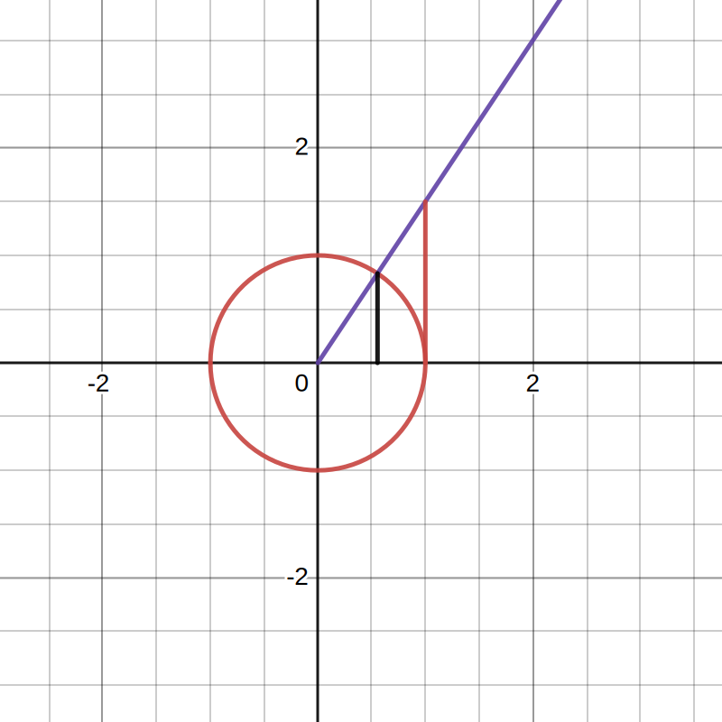
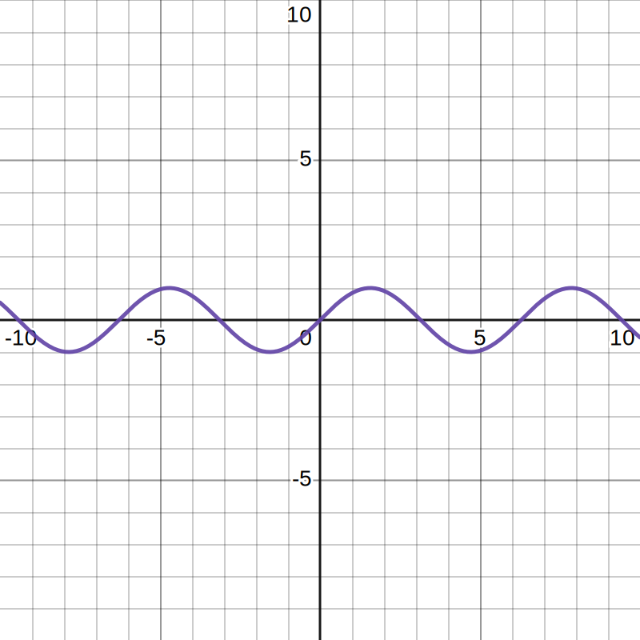
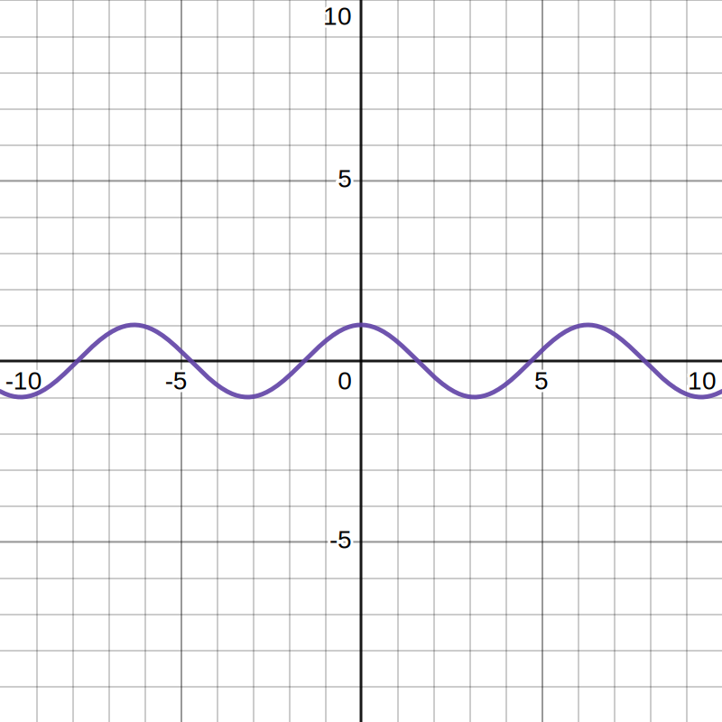
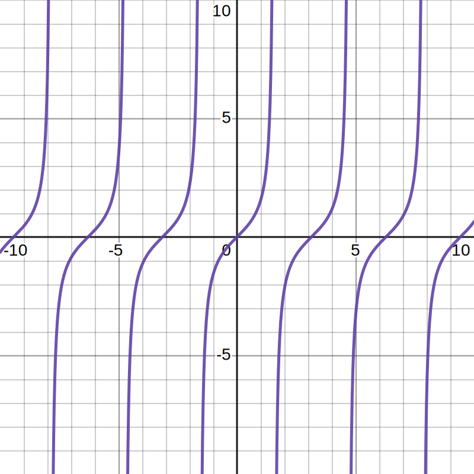

# 三角函数

> 以角为自变量,以单位圆上点的坐标或坐标的比值为函数值的函数,统称为**三角函数(trigonometric function)**.

| 名称          | 记作          | 单位圆的值             |
| ------------- | ------------- | ---------------------- |
| 正弦(sine)    | $\sin \alpha$ | $y$                    |
| 余弦(cosine)  | $\cos \alpha$ | $x$                    |
| 正切(tangent) | $\tan \alpha$ | $\frac {y}{x}(x\ne 0)$ |
| 余割()        | $\csc$        | $\frac {1}{y}$         |
| 正割()        | $\sec$        | $\frac {1}{x}$         |
| 余切()        | $\cot$        | $\frac {x}{y}$         |

## 三角函数线

O,P,T

O,M,A

| 三角函数线 | 有向线段(directed line segment) |
| ---------- | ------------------------------- |
| 正弦线     | $MP=y=\sin \alpha$              |
| 余弦线     | $OM=x=\cos \alpha$              |
| 正切线     | $AT=\frac {y}{x}=\tan \alpha$   |

1. $\sin ^2\alpha +\cos ^2\alpha =1$ 
2. $\frac {\sin \alpha }{\cos \alpha }=\tan \alpha$ 

## 公式

### 诱导公式(induction formula)

1. 公式一至四$\alpha +k\cdot 2\pi (k\in \mathbb {Z}),-\alpha ,\pi \pm \alpha$ 的三角函数值,等于$\alpha$ 的同名函数值, ~~加上$\alpha$ 看成锐角时原函数值的符号~~ 根据象限变一下.
2. 公式一
   1. $\sin (\alpha +k\cdot 2\pi )=\sin \alpha$ 
   2. $\cos (\alpha +k\cdot 2\pi )=\cos \alpha$ 
   3. $\tan (\alpha +k\cdot 2\pi )=\tan \alpha$ 
   4. 其中$k\in \mathbb {Z}$ .
3. 公式二
   1. $\sin (\pi +\alpha )=-\sin \alpha$ 
   2. $\cos (\pi +\alpha )=-\cos \alpha$ 
   3. $\tan (\pi +\alpha )=\tan \alpha$ 
4. 公式三
   1. $\sin (-\alpha )=-\sin \alpha$ 
   2. $\cos (-\alpha )=\cos \alpha$ 
   3. $\tan (-\alpha )=-\tan \alpha$ 
5. 公式四
   1. $\sin (\pi -\alpha )=\sin \alpha$ 
   2. $\cos (\pi -\alpha )=-\cos \alpha$ 
   3. $\tan (\pi- \alpha )=-\tan \alpha$ 
6. 公式五至六$\frac {\pi }{2}\pm \alpha$ 的正弦(余弦)函数值,等于$\alpha$ 的余弦(正弦)函数值,加上$\alpha$ 看成锐角时原函数值的符号.
7. 公式五
   1. $\sin (\frac {\pi }{2}-\alpha )=\cos \alpha$ 
   2. $\cos (\frac {\pi }{2}-\alpha )=\sin \alpha$ 
8. 公式六
   1. $\sin (\frac {\pi }{2}+\alpha )=\cos \alpha$ 
   2. $\cos (\frac {\pi }{2}+\alpha )=-\sin \alpha$ 

### 和差角公式

$$
\sin (\alpha \pm \beta )=\sin \alpha \cos \beta \pm \cos \alpha \sin \beta
$$

$$
\cos (\alpha \pm \beta )=\cos \alpha \cos \beta \mp \sin \alpha \sin \beta
$$

$$
\tan (\alpha \pm \beta )=\frac {\tan \alpha \pm \tan \beta }{1\mp \tan \alpha \tan \beta }
$$

### 和差化积公式

$$
\sin \alpha \pm \sin \beta =2\sin (\frac {\alpha \pm \beta }{2})\cos (\frac {\alpha \mp \beta }{2})
$$

$$
\cos \alpha +\cos \beta =2\cos (\frac {\alpha +\beta }{2})\cos (\frac {\alpha -\beta }{2})
$$

$$
\cos \alpha -\cos \beta =-2\sin (\frac {\alpha +\beta }{2})\sin (\frac {\alpha -\beta }{2})
$$

### 积化和差公式

$$
\sin \alpha \sin \beta =-\frac {1}{2}[\cos (\alpha +\beta )-\cos (\alpha -\beta )]
$$

$$
\cos \alpha \cos \beta =\frac {1}{2}[\cos (\alpha +\beta )+\cos (\alpha -\beta )]
$$

$$
\sin \alpha \cos \beta =\frac {1}{2}[\sin (\alpha +\beta )+\sin (\alpha -\beta )]
$$

$$
\cos \alpha \sin \beta =\frac {1}{2}[\sin (\alpha +\beta )-\sin (\alpha -\beta )]
$$

### 二倍角公式

$$
\sin 2\alpha =2\sin \alpha \cos \alpha
$$

$$
\cos 2\alpha =\cos ^2\alpha -\sin ^2\alpha=2\cos ^2\alpha -1=1-2\sin ^2\alpha
$$

$$
\tan 2\alpha =\frac {2\tan \alpha}{1-\tan ^2\alpha}
$$

### 半角公式

$$
\sin \frac {\alpha }{2}=\pm \sqrt {\frac {1-\cos \alpha }{2}}
$$

$$
\cos \frac {\alpha }{2}=\pm \sqrt {\frac {1+\cos \alpha }{2}}
$$

$$
\tan \frac {\alpha }{2}=\pm \sqrt {\frac {1-\cos \alpha }{1+\cos \alpha }}=\frac {\sin \alpha}{1+\cos \alpha }=\frac {1-\cos \alpha}{\sin \alpha }
$$

### 辅助角公式

$$
a\sin \alpha +b\cos \alpha =\begin {cases}
\sqrt {a^2+b^2}\sin (\alpha +\phi ) \\
\sin \phi =\frac {b}{\sqrt {a^2+b^2}},\cos \phi =\frac {a}{\sqrt {a^2+b^2}} \\
\tan \phi =\frac {b}{a} \\
\sqrt {a^2+b^2}\cos (\alpha -\theta ) \\
\sin \theta =\frac {a}{\sqrt {a^2+b^2}},\cos \theta =\frac {b}{\sqrt {a^2+b^2}}
\end {cases}
$$

### 万能公式

$$
\sin 2\alpha =\frac {2\sin \alpha \cos \alpha }{\sin ^2\alpha +\cos ^2\alpha }=\frac {2\tan \alpha }{1+\tan ^2\alpha}
$$

$$
\cos 2\alpha =\frac {\cos ^2\alpha -\sin ^2\alpha}{\sin ^2\alpha +\cos ^2\alpha }=\frac {1-\tan ^2\alpha }{1+\tan ^2 \alpha }
$$

$$
\tan 2\alpha =\frac {2\tan \alpha }{1-\tan ^2\alpha }
$$

### 降幂公式

[二倍角公式](#二倍角公式)2逆运算.

### 变种公式

[和差角公式](#和差角公式)3特殊运用
$$
\frac {1\pm \tan \alpha }{1\mp \tan \alpha }=\tan (\frac {\pi }{4}\pm \alpha )
$$

## 三角函数图像与性质

正弦曲线(sine curve)

余弦曲线(cosine curve)

$(0,0)(\frac {\pi}{2},1)(\pi ,0)(\frac {3\pi }{2},-1)(2\pi ,0)$ 

### 周期

对于函数,存在一个非零常数$T$ ,使得$x$ 取定义域内的每一个值,都有$f(x+T)=f(x)$  那么叫做**周期函数(periodic function)**.非零常数$T$ 叫做这个函数的**周期(period)**.

所有周期中最小正数为**最小正周期(minimal positive period)**.

$y=A\sin (\omega x+\phi),x\in \mathbb {R}$ $y=A\cos (\omega x+\phi),x\in \mathbb {R}$ 的周期$T=\frac {2\pi }{\omega }$ .

### 性质

| $y=\sin x$                     | $y=\cos x$                     | $y=\tan x$                     |
| ------------------------------ | ------------------------------ | ------------------------------ |
|  |  |  |

| 函数     | 奇偶 | 增区间$k\in \mathbb {Z}$                                    | 减区间$k\in \mathbb {Z}$                                    | 周期$(k\in \mathbb {Z}且k\ne 0)$ | 值域     |
| -------- | ---- | -------------------------------------------------- | -------------------------------------------------- | ------------------------ | -------- |
| 正弦函数 | 奇   | $[-\frac {\pi }{2}+2k\pi ,\frac {\pi }{2}+2k\pi ]$ | $[\frac {\pi }{2}+2k\pi ,\frac {3\pi }{2}+2k\pi ]$ | $2k\pi$                  | $[-1,1]$ |
| 余弦函数 | 偶   | $[\pi +2k\pi ,2\pi +2k\pi ]$                       | $[2k\pi ,\pi +2k\pi ]$                             | $2k\pi$                  | $[-1,1]$ |
| 正切函数 | 奇   | $(-\frac {\pi }{2}+k\pi ,\frac {\pi }{2}+k\pi )$   | /                                                  | $k\pi$                   | $\mathbb {R}$     |

### $y=A\sin (\omega x+\phi )$ 的图象

$\phi >0$ 向左平移 $\phi >0$ 向右平移

$\omega >1$ 压缩 $\omega <1$ 伸长

$A>1$ 拉高 $A>1$ 压低

$y=A\sin (\omega x+\phi )(其中A>0,\omega >0)$ 可以由$y=\sin x$ 平移$|\phi |$ 个单位,再把横坐标变为$\frac {1}{\omega }$ 倍,最后把纵坐标变为$A$ 倍.

> $A$ 为简谐运动的**振幅(amplitude of vibration)**,物体离开平衡位置的最大距离.
>
> $T=\frac {2\pi }{\omega }$ 为简谐运动的**周期(period)**,物体往复运动一次所需的时间.
>
> $f=\frac {1}{T}=\frac {\omega}{2\pi }$ 为简谐运动的**频率(frequency)**,物体在单位时间内往复运动的次数.
>
> $\omega x+\phi$ 为**相位(phase)**,$x=0$ 时的相位$\phi$ 为**初相(initial phase)**.

## 弧度制(radian measure)

> 把长度等于半径长的弧所对应的圆心角叫做1**弧度(radian)**的角,用符号$rad$ 表示,读作弧度.
>
> $半径r,圆心角\alpha 对应弧长l的弧度数绝对值为|\alpha |=\frac {l}{r}$ 

$$
180\degree =\pi rad\Rightarrow 
\begin {cases}
1\degree =\frac {\pi }{180}rad\approx 0.01745rad \\
1rad=(\frac{180}{\pi })\degree \approx 57.30\degree 
\end {cases}
$$
