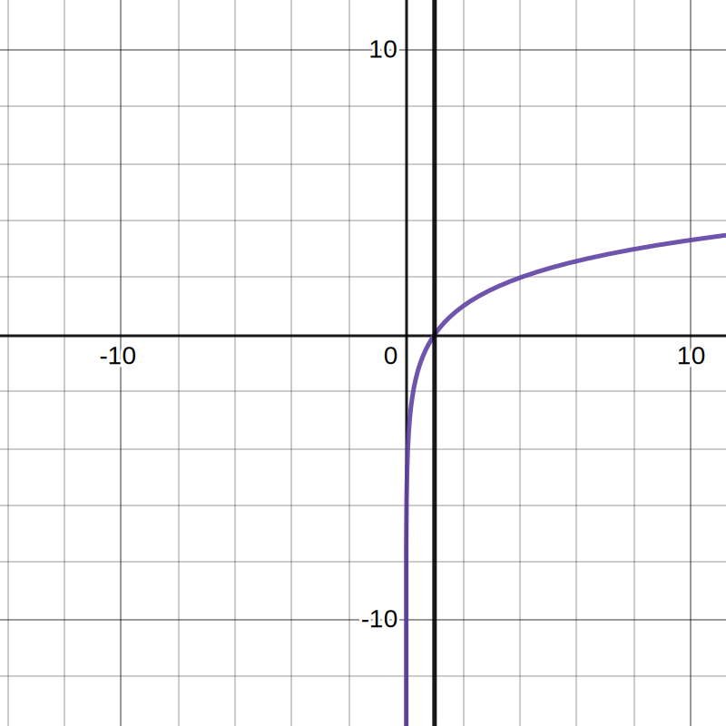

# 基本初等函数

### 函数的性质

##### 函数单调性

$设x_1,x_2是定义域上任意数,且x_1<x_2,$ 

$解f(x_1)-f(x_2),$ 

$若f(x_1)>f(x_2),则函数f(x)在（定义域）区间单调递增.$ 

$若f(x_1)<f(x_2),则函数f(x)在（定义域）区间单调递减.$ 

##### 函数极值

##### 函数奇偶性

$函数f(x)定义域内任一x,都有f(-x)=f(x),则f(x)为偶函数.$ 

$函数f(x)定义域内任一x,都有f(-x)=-f(x),则f(x)为奇函数.$ 

##### 方程的根与函数的零点

> 如果函数$y=f(x)$ 在区间$[a,b]$ 上的图象是有连续不断的一条曲线,并且有$f(a)\times f(b)<0$ ,那么,函数$y=f(x)$ 在区间$(a,b)$ 内有零点,即存在$c\in (a,b)$ ,使得$f(c)=0$ ,这个$c$ 也就是方程$f(x)=0$ 的根.

## 基本初等函数(1)

数学必修1 二 p47

### 指数函数

> 定义$y=a^x(a>0,且a\ne 1)为指数函数,x为自变量,x\in \R .$ 

| $0<a<1$                          | $a>1$                            |
| -------------------------------- | -------------------------------- |
|  |  |
| $y=(\frac {1}{2})^x$ $y=1$       | $y=2^x$ $y=1$                    |
| 定义域$\R $ 值域$(0,+\infty )$   | 同                               |
| 过定点$(0,1)$                    | 同                               |
| 在$\R $ 上是减函数               | 在$\R $ 上是增函数               |

1. $a^r\times a^s=a^{r+s}(a>0,r,s\in \Q )$ 
2. $(a^r)^s=a^{r\times s}(a>0,r,s\in \Q )$ 
3. $(a\times b)^r=a^r\times b^r(a>0,r\in \Q )$ 

### 对数函数

> 定义$a^x=N(a>0,a\ne 1),x叫做以a为底N的对数,记作x=log_aN,a叫做对数的底数,N叫做真数.$ 

$log_{10}N=lgN,log_eN=lnN$ $负数在R中无对数,0无对数.$ $log_a1=0,log_aa=1$ 

$当a>0,a\ne 1时,a^x=N\Leftrightarrow x=log_aN$. 

> 定义$y=log_ax(a>0,a\ne 1)为对数函数,x为自变量,x\in (0,+\infty ).$ 

| $0<a<1$                          | $a>1$                            |
| -------------------------------- | -------------------------------- |
|  |  |
| $y=log\frac {1}{2}x$ $x=1$       | $y=log_2x$ $x=1$                 |
| 定义域$(0,+\infty )$ 值域$\R $   | 同                               |
| 过定点$(1,0)$                    | 同                               |
| 在$(0,+\infty )$ 上是减函数      | 在$(0,+\infty )$ 上是增函数      |

1. $log_a(M\times N)=log_aM+log_aN(a>0,a\ne 1,M>0,N>0)$ 
2. $log_a\frac {M}{N}=log_aM-log_aN(a>0,a\ne 1,M>0,N>0)$ 
3. $log_aM^n=nlog_aM(a>0,a\ne 1,M>0,n\in \R )$ 
4. $log_ab=\frac {log_cb}{log_ca}(a>0,a\ne 1,c>0,c\ne 1,b>0)$ 

$对数函数y=a^x(a>0,且a\ne 1),指数函数y=log_ax(a>0,a\ne 1)互为反函数.$ 

### 幂函数

> 定义$y=x^a为幂函数,x为自变量,a是常数.$ 

过定点$(1,1)$ .$a$ 为奇数时函数是奇函数,$a$ 为偶数时函数是偶函数.在区间$(0,+\infty )$ 上,$a>0$ 函数是增函数,$a<0$ 函数是减函数.

##### ???

$y=x+\frac {a}{x}(a>0)$ 定义域$(-\infty ,0)\cup(0,+\infty )$ 值域$(-\infty ,-2\sqrt {a}]\cup [2\sqrt {a},+\infty )$ 极值$(\sqrt{a},2\sqrt{a}),(-\sqrt{a},-2\sqrt{a})$ 

$x^3\pm y^3=(x\pm y)(x^2\mp xy+y^2)$ $(x\pm y)^3=x^3\pm 3x^2y+3xy^2\pm y^3$ 

